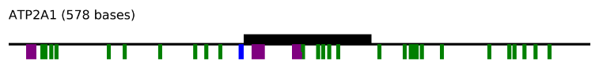
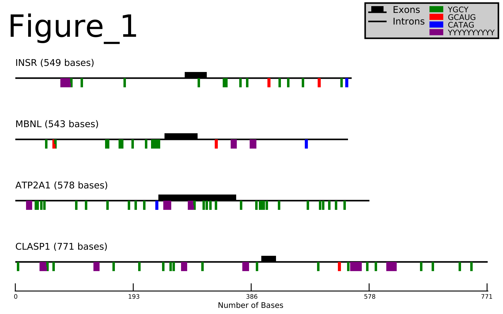

# Motif Mark

Pre-mRNA is transcribed from DNA, then undergoes splicing. Exons (the protein-coding regions of sequence) are selectivly included or excluded depending on several variables including splicing factors. Splicing factors are proteins that bind to specific motifs in pre-mRNA, and can mediate splicing patterns. Additionally, the position of the motif relative to exons in the pre-mRNA exons can play roles in how the transcript is processed.

Visualizing the positions of these protein-binding motifs can reveal trends associated with mRNA splicing.



## [motif-mark-oop.py](./motif-mark-oop.py)

motif-mark-oop.py is a python script that takes a fasta file of transcript reads with exons denoted as uppercase letters and introns as lowercase. Protein-binding motifs are read in as a text file with every motif on a new line in the file.

The output of this script is a png image with a visual representation the motifs in each sequence. Exons are shown as the black boxes above the sequence lines and the color boxes below the sequence lines represent the present motif(s) in that position of the sequence (motif colors coorispond to legend in upper right hand corner of the output image).

### Usage
#### Creating a Conda Environment

These instructions require the use of conda. For instruction on how to install conda see [installation documents](https://conda.io/projects/conda/en/latest/user-guide/install/index.html). 
1. Create the environment
    ```
    conda create -n pycairo conda-forge::pycairo
    ```
2. Activate conda environment
    ```
    conda activate pycairo
    ```

#### Running motif-mark-oop.py

There are two required arguments for motif-mark-oop.py: a properly formated FASTA file and a motifs file. The commandline arguments for these are ```-f``` and ```-m```, respectively. The output PNG image will have the same name as the input fasta file.

Below is an example using the test files in [examples](./examples/):
1. Ensure user permissions:
    ```
    chmod 755 motif-mark-oop.py
    ```
2. Command line execution:
    ```
    ./motif-mark-oop.py -f ./test-files/test_fasta.fa -m ./test-files/test_motif.txt
    ```
The output png will be in the same directory that motif-mark-oop.py is when it is executed.

#### [Example Image](./examples/Figure_1.png)
